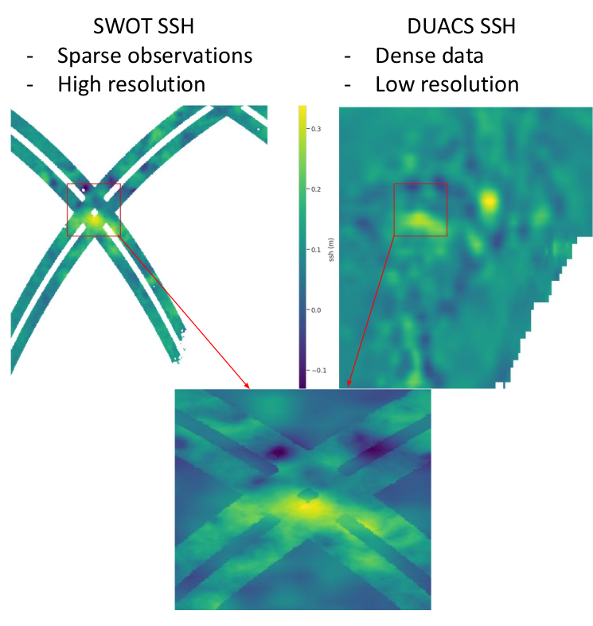
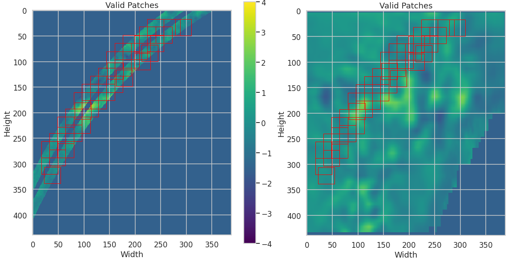

# Super_Resolution_FOCCUS
Super Resolution of sea surface height for the FOCCUS project.

The goal is to increase the resolution of the DUACS data set consisting of full, low resolution fields of SSH with a neural network using the new SWOT SSH fields consisting of sparse, high resolution fields of SSH.

# Usage

Run Testing.ipynb in Colab 

# Description of this repo

A Conditional Generative Adversarial Network (CGAN) was trained on matching pairs of DUACS and SWOT patches. The architecture was inspired by
https://jleinonen.github.io/ and is divided into

- data.py the data loader
- models.py with the generator and discriminator models
- gan.py implementing the adversarial training
- plots.py containing some plot and inference functions
- weights containing the weights of a trained network
- Testing.ipynb to test the super resolution and see different metrics (power spectrum, rmse, ensemble rmse)

# Description of the method

Patches from the same size were extracted from both the DUACS ans SWOT images at the same locations. These patches can overlap (with a maximum values of 80 commons pixels) and have a maximum threshold of 20 masked pixels (i.e. the SWOT image can not have more than 20 pixels with missing data). 

Then a generator, whose goal is to sample images that follow the distribution of the SWOT data, and a discriminator, whose goal is to determine whether an image is an output of the generator or a real SWOT image, are trained concurrently.
Both models are conditioned by a LR duacs image (the "context") which is larger in pixels that the patch we try to predict.

# Known current limitations

- Artefacts at the border of each patch.
- increase in MSE between the SR and the truth compared to the LR and the truth.
